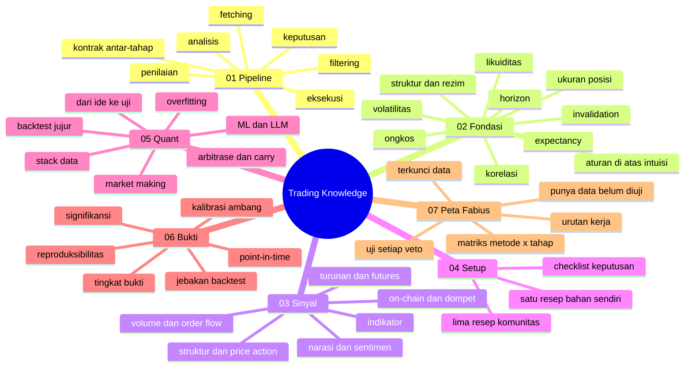

# 00 - Hub Trading Knowledge

**Sumber:** `vault/TradingKnowledge/`

Lapisan pengetahuan trading Fabius: metode, kaidah, dan cara mengujinya — dipetakan ke tahap
pekerjaan kita sendiri (fetching data → filtering → analisis → keputusan → eksekusi → penilaian).

Dia **bukan** tutorial dan **bukan** tempat klaim. Bedanya dengan catatan trading biasa ada di dua
kolom yang dipaksa ada di setiap halaman: **status data** (punya kita apa tidak) dan **tingkat
bukti** (siapa yang menguji, di mana). Dua kolom itulah yang membuat "strategi paling OP" berubah
dari pujian menjadi pertanyaan yang bisa dijawab.

Aturan main subtree ini: [[Aturan Subtree]]. Angka tentang produk ini cuma boleh datang dari
[[Fakta Terukur]] — halaman lain menyebut, tidak menghitung.



## Bagian

- [[Aturan Subtree]] — bentuk catatan, enum status data, peta ID, dan aturan bahwa transkrip model
  (`Plan.txt`, `QuantTrading/Info1.txt`) menyumbang daftar topik, bukan satu pun fakta
- [[Fakta Terukur]] — LEMBAR KUNCI: kedalaman data, ongkos 59 bps, ambang yang berlaku, hasil
  negatif, dan daftar alat yang angkanya belum boleh dikutip
- [[Glossary-TK]] — istilah lintas catatan, satu baris tiap istilah
- [[Sumber dan Jangkauan]] — status jujur tiap sumber di `Resources.txt`: mana yang dibaca (tidak
  ada), mana yang diprobe (penyedia data), dan mana yang ternyata mengubah rencana (P13)
- [[Templates/Template - Metode|kerangka catatan metode]] — bentuk yang ditegakkan
  `vault/scripts/tk_check.py`
- [[Templates/Template - Setup|kerangka catatan setup]] — resep kombinasi, dengan bagian wajib
  "konfluensi atau gaung"
- [[01-Pipeline/00 - Hub Pipeline]] — tujuh tahap pekerjaan + artefak yang ditinggalkan tiap tahap
- [[02-Fondasi/00 - Hub Fondasi]] — kaidah yang tidak bisa ditawar metode mana pun (struktur,
  likuiditas, ongkos, expectancy, ukuran, invalidation, rezim, korelasi, aturan vs intuisi)
- [[03-Sinyal/00 - Hub Sinyal]] — 38 metode per keluarga, satu catatan per metode, bentuk seragam
- [[04-Setup/00 - Hub Setup]] — kombinasi siap pakai + bagian wajib "konfluensi atau gaung"
- [[05-Quant/00 - Hub Quant]] — cara mengubah metode jadi hipotesis yang bisa dimatikan
- [[06-Bukti/00 - Hub Bukti]] — epistemik: apa yang menaikkan bukti, apa yang membuatnya palsu
- [[07-Peta-Fabius/00 - Hub Peta Fabius]] — lapisan keputusan: matriks, lubang, dan urutan kerja
  bernomor backlog

## Cara masuk kalau kamu tergesa

| kamu bertanya | mulai dari |
|---|---|
| "kenapa Fabius belum pakai indikator X?" | [[GAP1 - Matriks Metode x Tahap]] — biasanya jawabannya `TIDAK-ADA` data, bukan kelalaian |
| "apa yang boleh kami klaim?" | [[Fakta Terukur]] §F/§H lalu [[10-Submissions/01 - Claims Cheat Sheet]] |
| "kerja apa berikutnya?" | [[GAP5 - Urutan Kerja dan Bayarnya]] |
| "apa arti SMC / order block / funding ini?" | [[03-Sinyal/00 - Hub Sinyal]] |
| "kenapa win rate 69,8 % tidak boleh dijual?" | [[FD5 - Expectancy Bukan Win Rate]] |
| "bagaimana cara menguji sebuah ide?" | [[QT2 - Backtesting yang Jujur]] + [[EV2 - Jebakan Backtest]] |

## Terkait

- [[START-HERE]] · [[Conventions]] · [[Index]] · [[Quick-Reference]]
- [[Concepts/00 - Hub Concepts]] — konsep lintas-lapis (gerbang satu-arah, point-in-time, lookahead)
  yang dipakai di sini tanpa diduplikasi
- [[01-Agent/00 - Hub Agent]] · [[03-Data/00 - Hub Data]] · [[04-Tools/00 - Hub Tools]] ·
  [[06-Results/00 - Hub Results]]
- Bahan mentah lapisan ini: `vault/TradingKnowledge/Plan.txt` (peta metode, transkrip) dan
  `vault/TradingKnowledge/QuantTrading/Info1.txt` (peta quant, transkrip)

```dataview
LIST FROM #tk SORT file.folder ASC, file.name ASC
```
